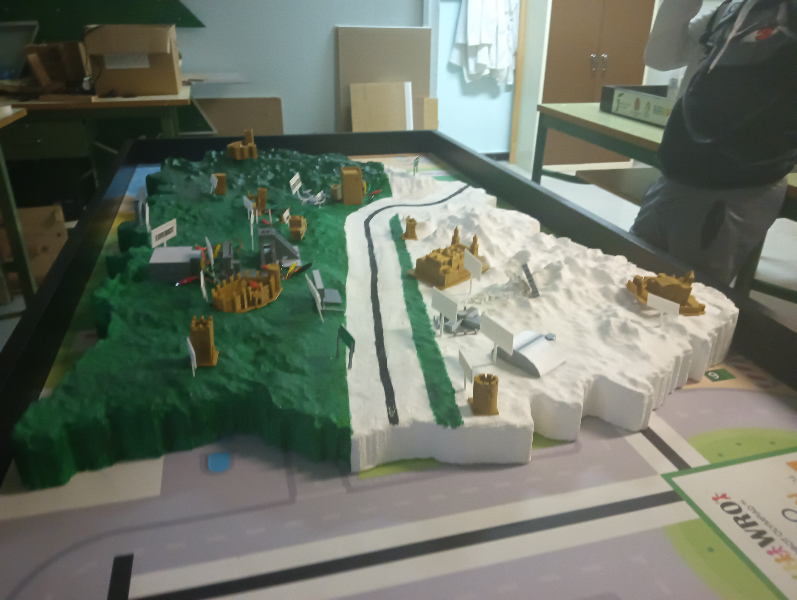
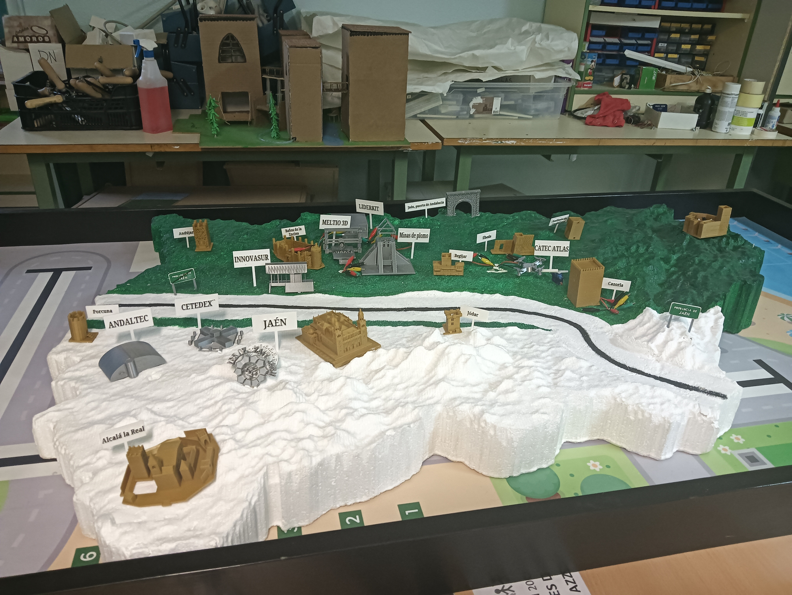
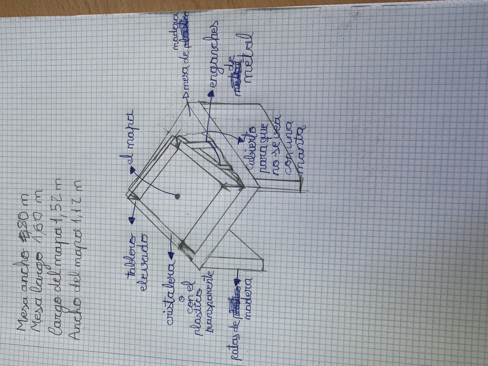
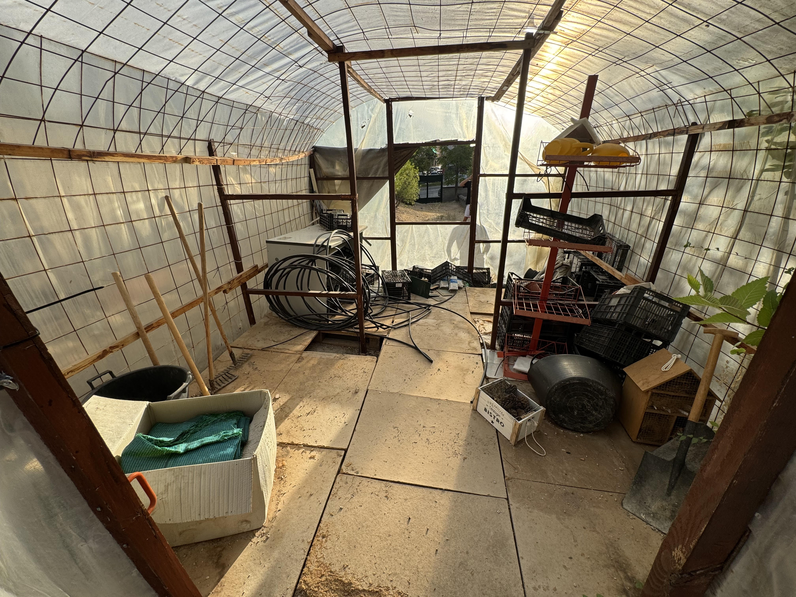
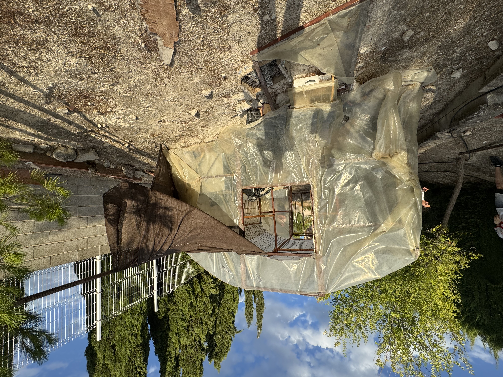
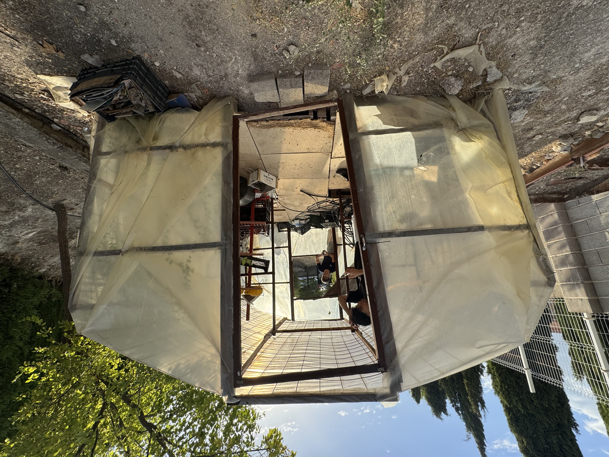

# Tecnología25-26
## Cuaderno de clase para tecnología 4 de ESO A hecho por Adrián Mena Serrano
# Parte 1.El mapa.
    

Este es el prototipo que he pensado hacer. Lo que hay que hacer es colocar el mapa en una mesa que este inclinada para que se pueda ver todo el mapa.Lo segundo es colocar unos listones para que la mesa no se caiga.Y lo tercero es poner poner una cristalera con un plastico transparente para que nadie toque el mapa.Aparte del prototipo estan tambien las fotos del mapa actual le falta que lo pinten entero de blanco colorcarlo en una mesa mas pequeña que en donde esta actualmente y comprarle sus respectivas cosas para que se vea más bonito y mejor que ahora mismo.
## Materiales que se necesitarian para el mapa.
Lo que yo creo que se necesitarian para el mapa son unas mesas que ya tenemos, listones que estan a 3,95 el más barato,tela para que no se vea los listones que de eso supongo que tenemos y metacrilato quue esta a 6,50 el más barato.Tambien varian los precios de pendiendo de cuanto necesitemos por cada objeto.
# Parte 2.El invernadero.
  
  

Lo que queremos hacer en este segundo trabajo es la recuperación del invernadero.Por tanto lo que teniamos que hacer es sacarle fotos y buscar posibles daños y soluciones para volver a recuperar el invernadero.Para ello habria que hacer un boceto principal de como queremos que quede el invernadero y si sale bien y si se puede hacer lo pasariamos al invernadero.Actualmente el invernadero no se puede utilizar por lo mal que esta y por el poco uso que se le a dado de mantenimiento estos años.Para ello hemos planeado reconstruirlo con sus respectivos materiales dependiendo de si salen o no del presupuesto.
## Materiales respectivos para el invernadero.
Los materiales que necesitariamos seria madera por metro cuadrado que el mas barato esta a 21 el metro una puerta de madera de 2m supongo esta a 63 el mas barato. Una ventanita seria unos 53 el más barato y el plastico de invernadero que el más barato esta a 31 euros dependiendo del tamaño del invernadero.
